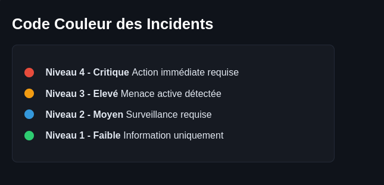

# 📊 SIEM Severity Legend - Système de Couleurs CSS

Ce projet est un composant d'interface utilisateur (*Cyber UI*) représentant la légende des niveaux de sévérité d'un **SIEM (Security Information and Event Management)**. L'objectif principal était de mettre en pratique les différents systèmes de gestion des couleurs en CSS3.

## 🎨 Objectifs Théoriques Appliqués

Chaque niveau de sévérité utilise un format de couleur CSS spécifique validé durant mon parcours d'apprentissage :

1. **Niveau 4 - Critique :** Codé en **Format Hexadécimal** (`#e74c3c`) pour un rouge d'alerte vif.
2. **Niveau 3 - Élevé :** Codé en **Format RGB** (`rgb(243, 156, 18)`) pour obtenir un orange intermédiaire texturé.
3. **Niveau 2 - Moyen :** Codé en **Format HSL** (`hsl(204, 70%, 53%)`) permettant de cibler précisément la teinte, la saturation et la luminosité d'un bleu d'avertissement.
4. **Niveau 1 - Faible :** Codé en **Couleur Unie** (`#2ecc71`) représentant un vert de fonctionnement nominal.

## 💻 Concepts Web Appliqués

- **HTML5 Sémantique avancé :** Remplacement des balises génériques par une structure de liste non-ordonnée (`<ul>` et `<li>`) pour donner du sens sémantique à la légende.
- **Reset & Nettoyage CSS :** Neutralisation des styles, marges et puces (`list-style: none`) natifs de la balise `<ul>`.
- **Mise en page Inline-Block :** Alignement horizontal fluide des pastilles de couleur circulaires (`border-radius: 50%`) à côté de leurs textes descriptifs respectifs via `display: inline-block` et `vertical-align: middle`.
- **Harmonisation Dark Mode :** Intégration globale du composant sur un fond sombre (`#0f131a`) avec des typographies adaptées sans empattement (*sans-serif*) pour une lisibilité optimale.

## Screenshot :

## Live Demo

https://cedricboucard.github.io/SIEM-Severity-Legend/